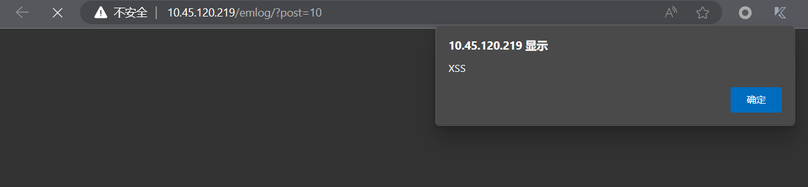

### Target

https://github.com/emlog/emlog

### Version

2.3.18

### Description

Attackers can write malicious JavaScript code in published articles to exploit XSS vulnerabilities.

### Detail

Malicious JavaScript code will be executed when the article is viewed

